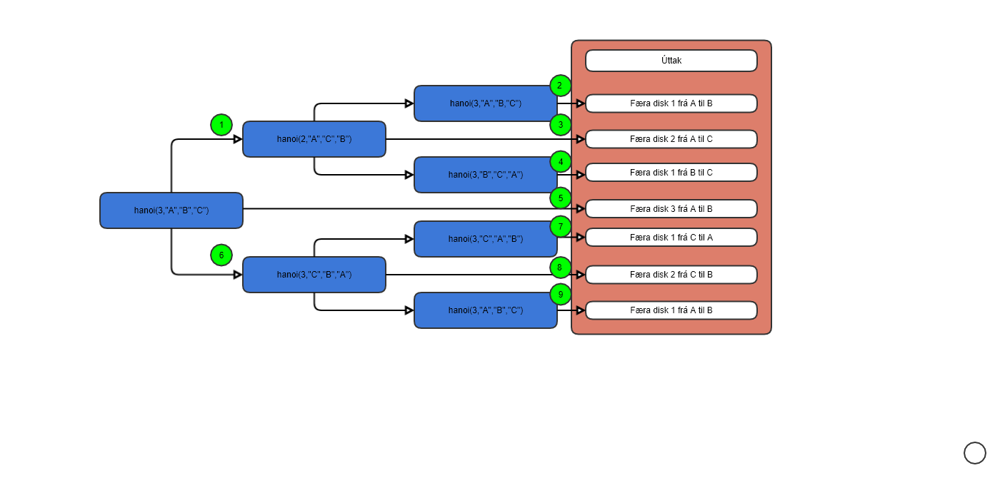

## 1. (1/15) Hér fyrir neðan er endurkvæmt fall hanoi(n,A,B,C) sem leysir þrautina Tower of Hanoi fyrir n – fjölda diska og súlurnar A, B og C. Skoðaðu fallið vandlega (fallið var skoðað í tíma). Þar fyrir neðan er flæðirit sem lýsir hvernig fallið keyrir þegar diskarnir eru 2. Gerðu samskonar mynd fyrir keyrslu á fallinu þegar diskarnir eru 3.

## 2. (1/15) Hver er flækjutími fallsins hanoi(n,A,B,C) í liðnum hér fyrir ofan? Rökstyddu svarið.

Flæku stigið er O(2^n) hvert skipti sem n þá tvöfaldast fjoldi kalla. Ef þú vilt vita hvað að verað mörg kall er jafna (2^n) - 1

## 3. (3/15) Útskýrðu stuttlega tímaflækjurnar hér fyrir neðan. Nefndu dæmi um reiknirit sem hafa
eftirfarandi tímaflækjur.
### a. O(n)
Þíðir að fallið er n lengi að keyra, þetta er frekar létt reikirit. Þetta reikin rit gæti verið að finna hluti í lista með eina lykkju, þetta gæti verið dæmi um Kadane's algorithm
### b. O(n^2)
Þetta er reiknirit sem er með lykkju inn í lykju eins og bubble sort.
### c. O(log(n))
Þetta flækistig gæti verið notða í reyknirit sem værir að leita að tölu tíl dæmis. Listinn mundi þurfa að verfa raðaður rekniritið finnur miðjutöluna og tékkar hvort talan sem hann á að finna sé lægri eða hægri en miðju talan. Ef hún er hærri eyðir reikniritið minni tölunum og gerir það svo koll á kalli þanag til talan er eftir. eða ef talan er ekki í arrayinu veit forritið það líka.

## 4. (3/15) Útfærðu fall sem býr til alla mögulega strengi af lengd n úr lágstöfum enska stafrófsins (26 bókstafir). Hver bókstafur má aðeins koma einu sinni fyrir í strengnum og hverja samsetningu þarf aðeins að búa til einu sinni. Dæmi um streng þar sem n = 4 er abcd (sem er sami strengur og abdc). Strengurinn aabc er ógildu þar sem sami bókstafur kemur fyrir tvisvar.

### a. (1/15) Hversu margir möguleikar eru fyrir strengi af lengd n?
26 nCr x. X er fjöldi bókstafa sem fallið á hafa.

### b. (1/15) Hver er flækjutími fallsins? Tímamældu fallið með mismunandi gildi n og taktu afstöðu út frá þeim niðurstöðum.
Flækjustig fallsins er o(nCr)

#### Tímamælingar.
þegar n = 3 tekur það sirka 1 ms.
þegar n = 4 tekur það sirka 7 ms.
þegar n = 5 tekur það sirka 41 ms.
þegar n = 26 tekur það sirka 0.2 ms.
Eftir að n er hærra mun forritið taka mikklu lengri tíma þangað til að það er komið í 13, þá fer tímin hægt niður.

## 5. (3/15) Útfærðu forritsem býr til lista af lengd m af ofangreindum strengjum af lengd n. Forritið á síðan að raða listanum í hækkandi stafrófsröð (strengurinn sem er fyrstur í listanum er fremstur í stafrófsröðinni). Útfærðu forritið þannig að listinn með strengjunum sé frumstilltur með versta tilviku (öfug stafrófsröð strengja). a. (1/15) Skiptir máli hvað strengir listans eru langir? b. (1/15) Tímamældu röðunina hjá þér, miðaðu við versta tilvik. Hver er flækjutíminn? c. Hugleiðing: Ef listinn innihéldi heiltölur, myndi röðunin ganga hraðar fyrir sig?

#### Tímamæling:
þegar n = 2 tók það sirka 23 ms.
þegar n = 3 tók það sirka 1749 ms.
þegar n = 4 tók það sirka 71357 ms.
var að nota idel og það var alltaf að chrass. Já lengdin á strengunum skiptir máli því fleiri því lengri. Flækutíminn er O(n^2).

#### Tölur

Ég prófaði að nota tölur og niður stöðurnar voru frekar svipaðar og fyrir ofann. Það tók að raða 2staf tölum 1648 ms. 

